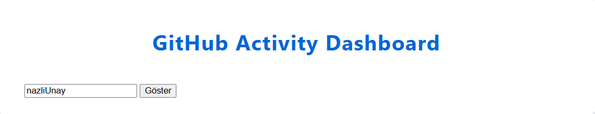
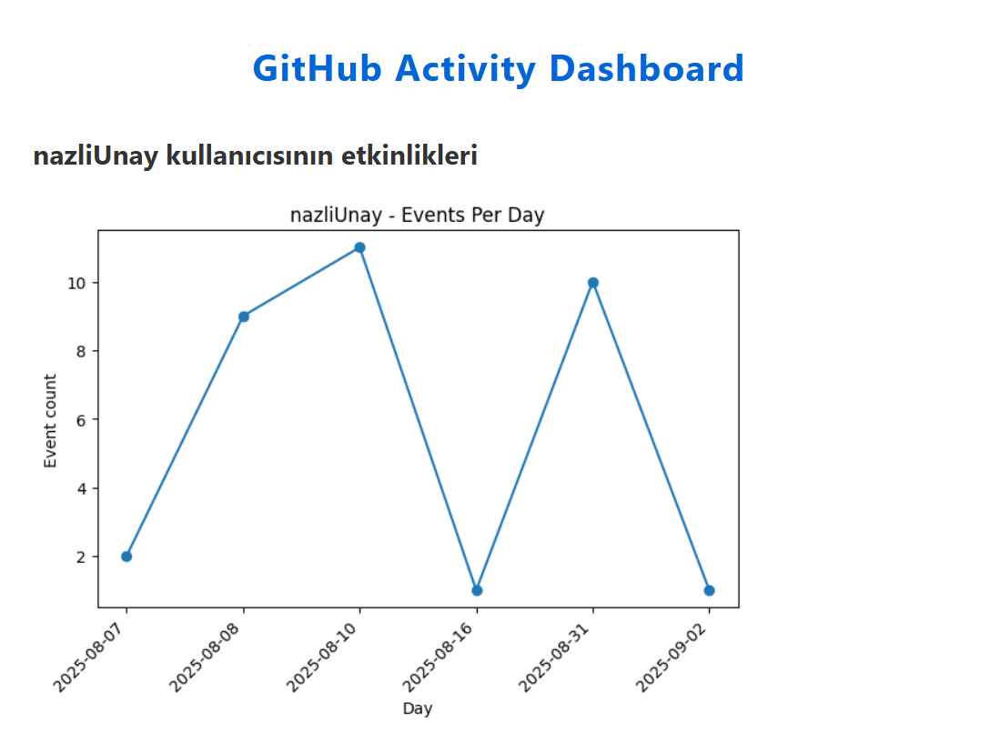
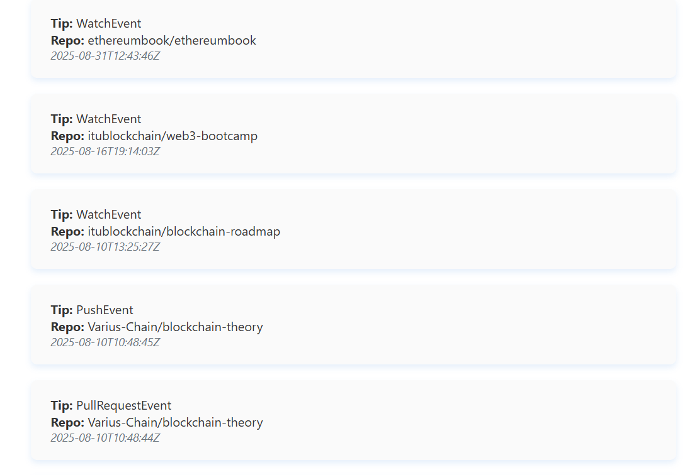

# 📊 Flask GitHub Activity

GitHub kullanıcılarının **etkinliklerini görselleştiren** basit bir Flask uygulaması.  
Uygulama, [GitHub Public Events API](https://docs.github.com/en/rest/activity/events?apiVersion=2022-11-28) üzerinden veri çekerek web arayüzünde listeler.

---

## 🚀 Özellikler
- Belirtilen GitHub kullanıcısının son aktivitelerini görüntüleme
- Flask tabanlı web arayüzü
- İstekler için `requests` kütüphanesi entegrasyonu
- Docker desteği (kolay dağıtım için)

---

## 🛠️ Kurulum ve Çalıştırma

### 1. Reponun Klonlanması
```bash
git clone https://github.com/NazliUnay/flask-github-activity.git
cd flask-github-activity
```

### 2. Sanal Ortam Oluşturma (Önerilen)
```bash
python -m venv venv
```
Aktifleştirme:
- **Windows**: `venv\Scripts\activate`
- **Linux/Mac**: `source venv/bin/activate`

### 3. Gerekli Bağımlılıkların Yüklenmesi
```bash
pip install -r requirements.txt
```

### 4. Uygulamanın Çalıştırılması
```bash
cd github-activity-flask
flask run
```

Tarayıcıda şu adrese git:
👉 [http://127.0.0.1:5000](http://127.0.0.1:5000)

---

## 🐳 Docker ile Çalıştırma
```bash
docker build -t flask-github-activity .
docker run -p 5000:5000 flask-github-activity
```

---

## 📷 Ekran Görüntüsü
### Kullanıcı Giriş ###


### Grafik ###


### Kullanıcı Olayları ###


---

## 👩‍💻 Geliştirici Bilgileri

- **Ad Soyad**: Şerife Nazlı Ünay  
- **Üniversite**: Necmettin Erbakan Üniversitesi  
- **Bölüm**: Bilgisayar Mühendisliği  
- **LinkedIn**: [linkedin.com/in/serife-nazli-unay](https://www.linkedin.com/in/serife-nazli-unay/)

---

## ✉️ İletişim

Her türlü öneri, soru veya geri bildirim için benimle iletişime geçebilirsiniz:  
📧 unay.nazli42@gmail.com


